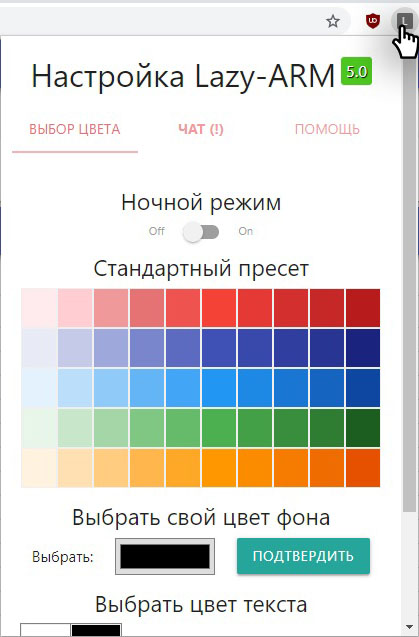

## Chrome lazy arm 5.0

 

P.S: Рано или поздно все это будет добавлено аналитиками (пока не ясно в каком виде), а сейчас можно воспользоваться расширением.

## Где взять?
[Скачать последнюю версию по этой ссылке](https://github.com/JustMonk/chrome-lazy-arm/releases/download/5.0/chrome-lazy-arm-5.rar)

## Зачем?

Вывести количество свободных

Изменить цвет шапки/шрифта (клик по значку расширения открывает настройки)

Есть возможность переключиться на темную схему

## Как включить? (инструкция по шагам)

1) [Скачать архив](https://github.com/JustMonk/chrome-lazy-arm/releases/download/5.0/chrome-lazy-arm-5.rar), распаковать;
2) В адресной строке браузера ввести `chrome://extensions/`

3) В правом верхнем углу включить режим разработчика

4) В появившемся меню выбрать "Загрузить распакованное расширение"

5) Указать путь до распакованной папки

6) Готово
