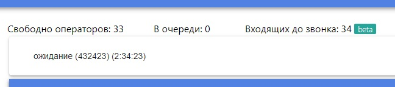
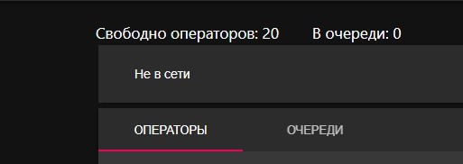

## Chrome lazy arm 6.0

 

## Где взять?
[Скачать последнюю версию по этой ссылке](https://github.com/JustMonk/chrome-lazy-arm/releases/download/6.0/chrome-lazy-arm-6.rar)

## Зачем?

Вывести количество свободных. 

Добавлена возможность посмотреть свою очередь на звонок, основываясь на времени ожидания (показатель условный, не учитывает скиллы и приоритеты)

Изменить цвет шапки/шрифта (клик по значку расширения открывает настройки)

Можно добавить ссылку для изображения в фон (но пока без дополнительных опций, я бы не злоупотреблял)

Есть возможность переключиться на темную схему

## Как включить? (инструкция по шагам)

1) [Скачать архив](https://github.com/JustMonk/chrome-lazy-arm/releases/download/6.0/chrome-lazy-arm-6.rar), распаковать;
2) В адресной строке браузера ввести `chrome://extensions/`

3) В правом верхнем углу включить режим разработчика

4) В появившемся меню выбрать "Загрузить распакованное расширение"

5) Указать путь до распакованной папки

6) Готово

P.S: аналогичным образом будет работать в Opera/Yandex/Любой браузер на движке chromium
