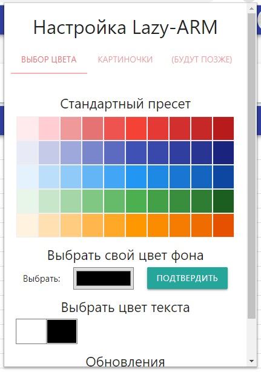
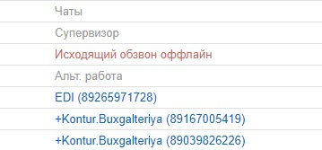
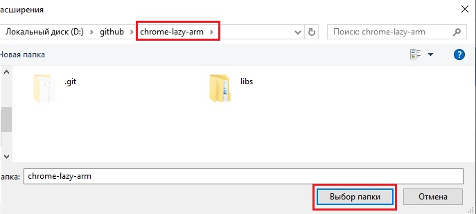

## chrome lazy arm 4

Есть ли на свете более бесполезная вещь? А теперь еще и с ночным режимом

## Где взять?
[Скачать по этой ссылке](https://github.com/JustMonk/chrome-lazy-arm/releases/download/4.0/chrome-lazy-arm-4.rar)

## Известные проблемы

Расширение будет работать только по "боевому" адресу `/cc-agent/`, на тестовый `/cc-agent-test/` заходить не нужно

## Зачем?

Посмотреть количество свободных (косяк в запросе исправлен)

Изменить цвет шапки/шрифта (клик по значку расширения открывает настройки)

Выделения рабочих перерывов нет

Аналитики уже реализовали

## Как включить?

1) [Скачать архив](https://github.com/JustMonk/chrome-lazy-arm/releases/download/4.0/chrome-lazy-arm-4.rar), распаковать;
2) В адресной строке браузера ввести `chrome://extensions/`

3) В правом верхнем углу включить режим разработчика

4) Указать путь до распакованной папки

5) Готово
